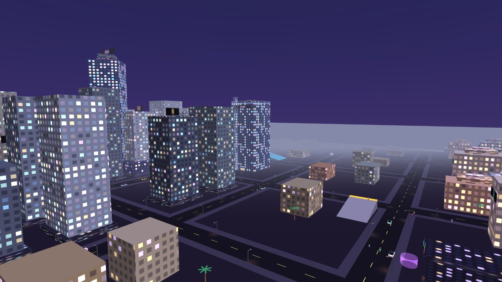
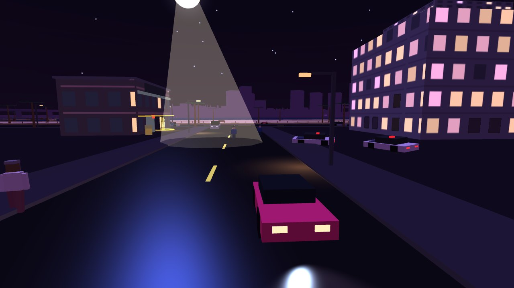
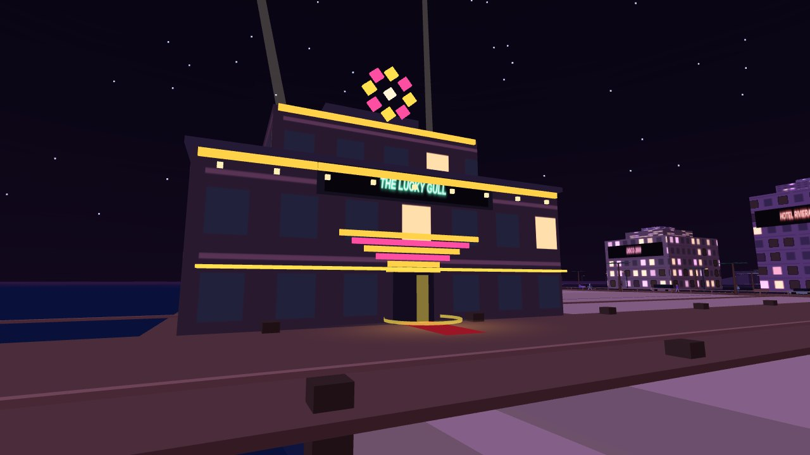
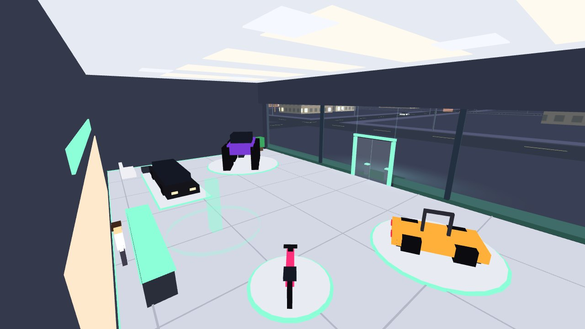
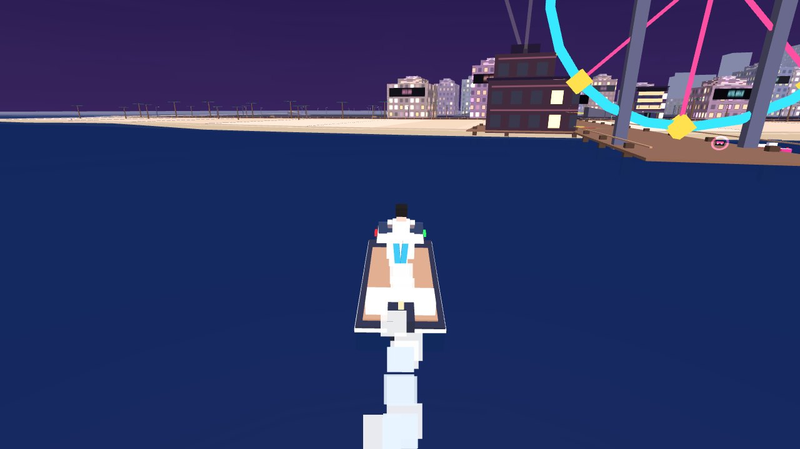
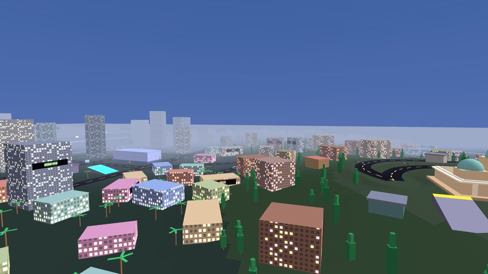

# NEON MAYHEM

**Costa Rosa, 1986.** A neon open world you play in your browser. Steal a ride, outrun the heat, take a job, buy a condo with the takings. Or just cruise the beachfront at night with the radio on.

<p align="center">
  <a href="https://pranshuparmar.github.io/neon-mayhem/"></a>
</p>

<p align="center">
  <b><a href="https://pranshuparmar.github.io/neon-mayhem/">▶ PLAY NOW — free, in your browser</a></b><br>
  <sub>No install, no account, no ads · keyboard, controller or touch · saves in your browser and runs offline</sub>
</p>

A free, fan-made tribute inspired by Grand Theft Auto: Vice City (2002). Everything in the project is original work — the sentence you just read is the only place the original game is named.

## What you can do

- 🚗 **Drive anything** — sports cars, bikes, a limo, an ice-cream truck, a monster truck. Drift, crash, catch fire.
- 🚁 **Fly and sail** — a helicopter, a plane that loops and rolls, parachutes, speedboats and a jet ski. Or swim off the beach.
- 🚓 **Outrun the law** — five stars of heat: roadblocks, spike strips, harbour launches, a helicopter. Break their line of sight to lose them.
- 💼 **Take the work** — street races, couriers, rampages, takedowns, taxi and ambulance shifts, Lola's story jobs, and favours for strangers.
- 🏝️ **Two islands** — the neon mainland, and Isla Verde across the channel once you've earned the bridges.
- 🏠 **Walk in** — every shop, a casino with horse racing, a glass car showroom, and homes you can buy.
- 🔍 **Hunt** — 25 stunt jumps and 30 lost mixtapes hidden around both islands.
- 📻 **Turn up the radio** — three synth stations, every note made live in your browser.
- 📟 **Ask Lola** — she can show you around on day one, tips you off the first time you meet anything, and `L` asks her what to do next.
- 📷 **Take pictures** — an old film camera that prints the city like it's 1986.

Want the details? **[Read the full tour →](docs/FEATURES.md)**

## Screenshots

<table>
  <tr>
    <td width="33%"><br><sub>Centro Alto at dusk</sub></td>
    <td width="33%"><br><sub>A four-star chase</sub></td>
    <td width="33%"><br><sub>The Lucky Gull</sub></td>
  </tr>
  <tr>
    <td width="33%"><br><sub>Gran Rosa Motors</sub></td>
    <td width="33%"><br><sub>Off the east pier</sub></td>
    <td width="33%"><br><sub>Isla Verde</sub></td>
  </tr>
</table>

## What's new

- 🗞️ **A city with its own business** — getaway chases, hold-ups, an armoured van and racers at the lights; a dozen strangers with a favour each, on both islands; and the morning paper when you make the news.
- 🌊 **Life on the water** — jet skis and boats out in the bay, a jet ski of your own at the northern pier, and the harbour patrol's launches when you're wanted at sea.
- 🎓 **Lola's first day** — a new game can be shown around: a ride, a first delivery, then a new look at the barber with the pay.
- 🏠 **Walk-in interiors** — every shop, your homes, the casino's horse races, and a glass showroom with the helicopters on its roof.
- 🌊 **The sea** — swim, take a speedboat, run the BAY REGATTA and CONTRABAND jobs.
- 🚓 **A city that answers** — drivers who flee or fire back, manhunts you can escape, rain and a live clock.
- 📟 **Lola on call** and 📷 **a 1986 film camera**.
- 🛗 **More to find** — a glass lift up the helipad tower, takedowns, ten Isla Verde jumps and thirty lost tapes.
- 🔉 **A city you can hear** — traffic going by, people about, your own footsteps, the surf and the gulls, kept quiet.

## Controls

The basics. Keys can be rebound from **CONTROLS** on the pause screen.

| | Keyboard & mouse | Controller | Touch |
|---|---|---|---|
| Move · look | `W A S D` · mouse | left stick · right stick | stick · drag the right side |
| Sprint · jump | `Shift` · `Space` | B · A | RUN · JUMP |
| Aim · fire | RMB · LMB | LT · RT | AIM · FIRE |
| Get in · get out | `F` | Y | ENTER · EXIT |
| Drive · handbrake | `W A S D` · `Space` | RT / LT and left stick · A | GAS / BRAKE and stick · ⇋ |
| Horn | `G` | R3 | 📢 |
| Map · pause | `P` · `Esc` | BACK · START | tap the radar · ❚❚ |
| Ask Lola | `L` | START → 📟 ASK LOLA | 📟 · ❚❚ → 📟 ASK LOLA |

Flying, boats, menus and everything else: **[all controls →](docs/CONTROLS.md)**

## Run it locally

Serve the folder from any static host (GitHub Pages works as-is):

```
python3 -m http.server 8000
# open http://localhost:8000
```

The only network request the game ever makes is an anonymous visit count (see [Analytics](#analytics)), skipped entirely when you run it locally or offline.

## Tech

- Plain JavaScript and [three.js](https://threejs.org/) r128 (MIT, see [THREE.LICENSE](THREE.LICENSE)), vendored at `js/lib/three.min.js`. No build step; it runs from `file://` or any static host.
- All music and sound are synthesized at runtime with the Web Audio API.
- Every change ships only after headless verification: `test/smoke.js` and `test/regressions.js` run in CI on every push.
- More in [Under the hood](docs/FEATURES.md#under-the-hood).

## Analytics

The published site counts visits and a handful of anonymous events — things like a session started, a mission or shift finished, a stunt jump found, a wanted level reached, aircraft flown, the bridges opened, a shop purchase made, a result card saved or shared — via [GoatCounter](https://www.goatcounter.com/): cookieless, no identifier stored in the browser, and nothing about you kept. `js/analytics.js` is a thin wrapper that silently no-ops when the counter is blocked or unavailable, so the game never depends on it. It is skipped entirely on `file://`, `localhost` and LAN addresses — a local or offline copy makes no network request at all.

## Disclaimer

Fan-made tribute. Not affiliated with Rockstar Games or Take-Two Interactive. No original game assets used. All city names, brands, characters, and music in this project are invented; audio is synthesized at runtime.
